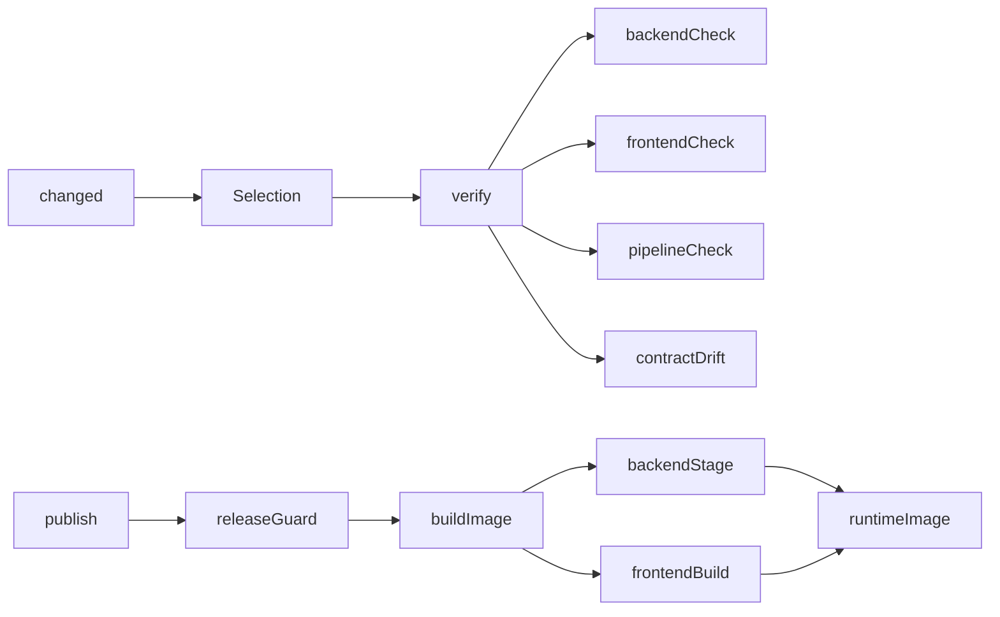

# Pipeline design

> Standard: Agentic Engineering Standards v1.2.0

## Overview

CI is a single TypeScript Dagger module (`.dagger/`) that verifies and packages the app. It is
deliberately small: an affected-component selector over three components — `backend`, `frontend`,
and the `pipeline` itself — plus the `contract` that binds the two app halves. There is no monorepo
module-graph or multi-service machinery.

Verifying and releasing are separate concerns. `verify` runs the affected checks; `buildImage` and
`publish` build and ship and do **not** re-run the checks. A release therefore runs `verify --all`
first (in CI or by hand), mirroring the `build` vs `buildFactory` split in the reference pipeline.

## Domain model

- **Component** — `backend`, `frontend`, or `pipeline`.
- **Selection** — the result of classifying a change set: `none`, `some` (a subset), or `all`.
  `all` is kept distinct from listing every component so callers special-case "everything" without
  counting.
- Path classification: `backend/**` → backend; `frontend/**` → frontend; `.dagger/**` → pipeline;
  `contract/**` → both app components (generated from the backend, consumed by the frontend);
  anything else → no component.

## Processing rules

- `changed(base?)` maps `git diff --name-only` (against the merge-base with `origin/main` by
  default) to a Selection.
- `verify(base?, all?)` runs only the affected components' checks: `backendCheck` when backend is
  affected, `frontendCheck` when frontend is affected, `pipelineCheck` when the pipeline is
  affected, and `contractDrift` whenever the backend is affected (a `contract/**` change maps to
  both app components, so it is covered too). `verify --all` runs every check.
- `contractDrift` regenerates the OpenAPI document and the TypeScript client from the backend and
  fails on any difference from the committed `contract/`.
- `buildImage(platform?)` builds the runtime image from two builder stages; it does not verify.
- `version` derives the version from git; `releaseGuard` refuses a dirty tree or an untagged HEAD;
  `publish` builds a guarded release image and pushes it; `deploy` prints the NAS pull command.

## Edge cases

- No relevant paths changed → `verify` reports "nothing affected" and exits zero.
- A frontend-only change runs `frontendCheck` alone; backend, contract, and pipeline checks are
  skipped. A pipeline-only change runs `pipelineCheck` alone.
- A `contract/**` change is treated as affecting both app components.
- Single-commit or shallow history: `changed` falls back to the root commit when no merge-base
  exists.

## Invariants

- `verify` runs the checks only for affected components; an unaffected component's checks never run.
- The runtime image contains no build tools — sbt, Node, and the JDK compiler live only in builder
  stages; the backend ships its own bundled jlink runtime.
- The runtime image runs as a non-root user and is built for the deploy architecture (linux/amd64
  by default, the NAS arch).

## Component architecture

Ports and adapters. Pure logic — `domain.ts` (types), `selection.ts` (path → Selection), and
`version.ts` (git describe → version) — is unit-tested to 100%. Side-effecting work lives behind
adapter modules under `hooks/` (`git`, `backend`, `frontend`, `contract`, `pipeline`, `image`), the
only code that touches containers; it is excluded from coverage. `index.ts` is the thin `@object`
class that wires functions to hooks.

## Tech debt

- A pipeline-only change runs `pipelineCheck` (Vitest on the pure logic) but not the component
  builds, so a change to *how* a component is built/tested is only fully exercised by a `verify
  --all` before release. That full sweep is the release gate.
- The jlink runtime is built with `JlinkIgnore.everything`, which is permissive about optional
  missing module dependencies; the module set is validated by the image actually running.
- `releaseGuard`'s dirty-tree check relies on `git status --porcelain` over the uploaded working
  tree; upload can in principle perturb file metadata. It is used only for releases.
