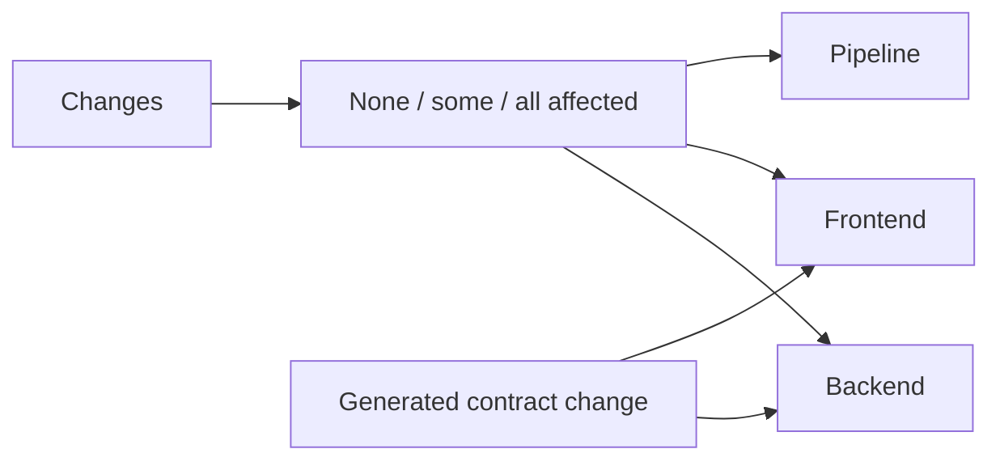
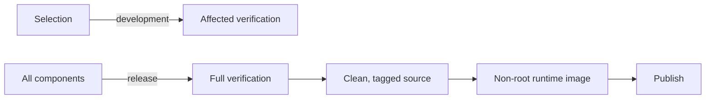

# Pipeline design

> Standard: Agentic Engineering Standards v1.2.0

## Overview

The pipeline selects checks by affected component, then builds and publishes a single runtime image after full release verification.

## Domain model

A backend change also verifies contract drift because the backend owns the API contract and the frontend consumes it.

## Use cases and workflows

Building and publishing do not rerun checks. A pipeline-only change can pass affected verification without building the application; full verification closes that gap before release.
