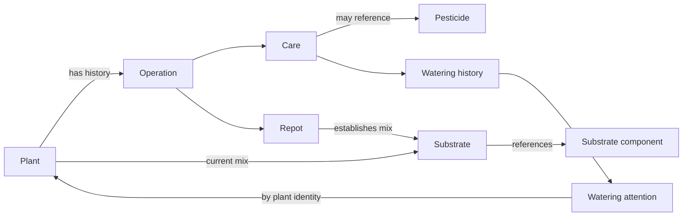
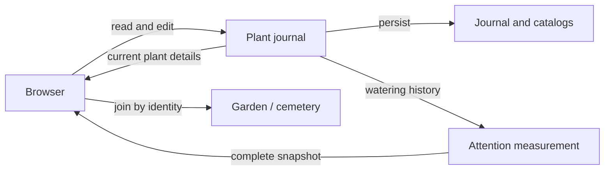

# plant-journal design

> Standard: Agentic Engineering Standards v1.2.0

## Overview

The journal owns plant identity and dated care history. Watering attention is a periodically refreshed projection, joined to current plant details only for presentation.

## Domain model

- Latest repot by recorded date and identifier determines the current mix, not the order of entry. Catalog identities remain stable across edits so historical references keep their meaning.
- Archiving keeps plant history and its care-date range but prevents new operations; existing operation details may still be corrected without changing their date or kind.

## Use cases and workflows

- Operation mutations are serialized. A latest-repot change that fails to update the plant compensates the operation write and preserves both failures if compensation also fails.
- The garden loads active plants and an archived count; the cemetery loads archived histories only when opened. Unrelated attention identity mismatches fail the garden load; a recently archived plant may still appear in the last measurement.
- An initial attention read must succeed to serve the app. Later refresh failures keep the last complete projection; insufficient watering history leaves cadence unavailable.
