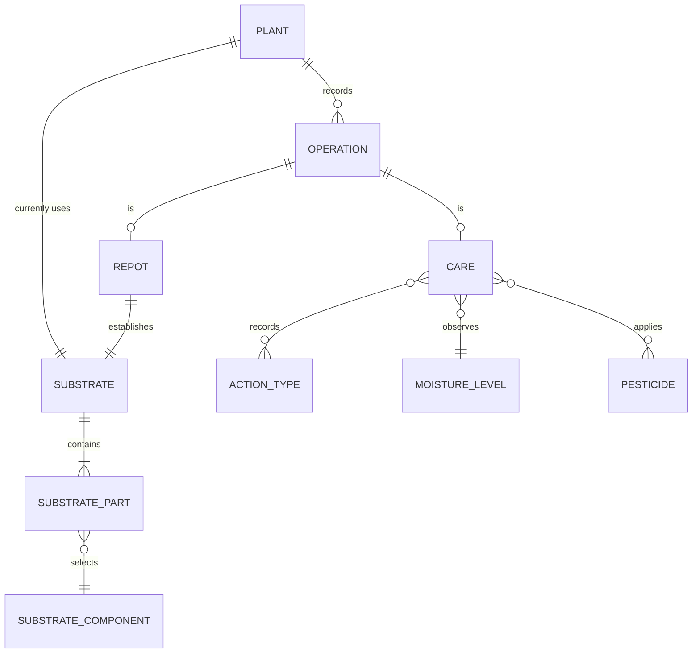
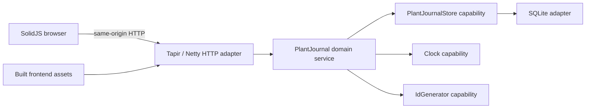

# plant-journal design

> Standard: Agentic Engineering Standards v1.2.0

## Service overview

plant-journal keeps the household's plants, current substrates, and dated care history. A direct-style Scala backend owns the journal rules and persists them in SQLite; a SolidJS browser lists active plants, shows their three most recent operations, and provides operation logging and editing.

## Domain model

A Plant has fixed descriptive details, an active or archived status, and a current Substrate. Each Operation belongs to one Plant and is either a Care operation or a Repot operation. Substrate-components and Pesticides are editable nomenclatures with stable identifiers, names, and optional usage information; each Pesticide also has a Fungicide, Insecticide, or Treatment type. A Substrate records component identifiers and percentage shares, while a Care operation records selected pesticide identifiers. Moisture-levels, Action-types, and Pesticide types are fixed English vocabularies; free text remains verbatim.

## Processing rules

- Journal reads return active plants and a requested plant's operations. Every persisted row is validated before plant-status filtering, so malformed archived rows cannot disappear silently.
- Logging assigns the operation identifier and timestamp in the backend. Care logging changes only the journal; repot logging also changes the plant's current substrate.
- A repot log succeeds only after both the operation and current substrate are persisted. If the substrate update or its prerequisite read fails, the new operation is removed; a failed compensation is reported with the original failure.
- Editing may change only kind-specific operation details. Editing the latest repot also updates current substrate; editing an older repot does not. A failed latest-repot substrate update restores the previous operation details.
- Log and edit workflows are serialized so their synchronization and compensation steps cannot interleave.
- Operations cannot be deleted by users because they record care that already happened.
- Substrate-component and pesticide catalogs can be listed, extended, and edited, but not deleted. Editing preserves the stable identifier used by existing substrates and operations.
- The browser loads both catalogs for operation forms. Substrate-components are defined or edited beside a substrate mix; pesticides are defined or edited beside the pesticide choices. Each editor opens in an adjacent sheet without replacing the operation form.
- The browser orders plants for display and shows each plant's three latest operations from oldest to newest. After a successful log or edit, it reloads the journal from the backend.

## Edge cases

- An empty journal and an operation-list read for an unknown plant both return an empty collection.
- A missing plant or operation in a single-record workflow is distinct from an empty collection.
- Editing an operation as the other operation kind is rejected without changing the journal.
- Editing a missing nomenclature is distinct from a catalog-access failure.
- Independently malformed persisted rows are all reported together and attributed to their plant or operation identifiers.
- Database-access failures are reported separately from stored-data corruption.
- API failures remain explicit failures in the browser; the interface does not present stale writes as successful.

## Invariants

- Every Substrate is non-empty, contains each Substrate-component at most once, assigns each part a share from 1 through 100, and has a total share no greater than 100.
- A Care operation carries no Substrate; a Repot operation always carries one.
- An Operation's identifier, Plant, timestamp, and care-or-repot kind never change after logging.
- When a Plant has repot operations, its current Substrate matches its latest repot after every successful log or edit.
- Nomenclature identifiers remain stable when their editable name, information, or pesticide type changes.
- Every Pesticide has exactly one supported Pesticide type.
- Controlled-vocabulary values are English; nomenclature text and other free text are preserved verbatim.
- Domain behavior depends on injected capabilities and never on HTTP, SQLite, clocks, or identifier implementations directly.

## Component architecture

The domain defines the journal behavior and capability ports. The application wires direct-style adapters into those capabilities; adapters translate HTTP, persistence, clock, and identifier concerns without owning business orchestration.

