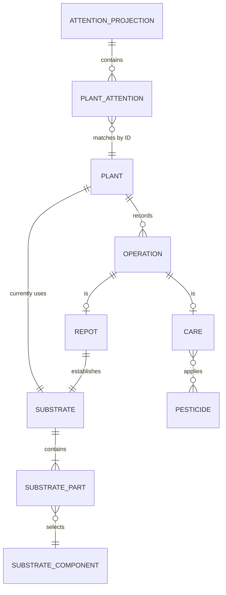
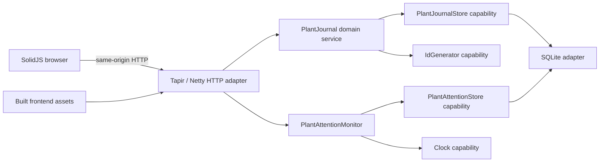

# plant-journal design

> Standard: Agentic Engineering Standards v1.2.0

## Service overview

plant-journal keeps the household's plants, current substrates, and dated care history. The backend persists journal state and periodically measures watering attention; the browser orders the active garden by attention and displays recorded care dates in the archived cemetery, with recent and historical operations.

## Domain model

- A Plant has descriptive details, an active or archived status, a current Substrate, and a recorded care range derived from its Operations. Each dated Operation belongs to one Plant: Care records moisture, actions, and optional pesticide selections; Repot records a new substrate. The latest repot by date and identifier determines the current substrate.
- A Substrate is a mix of percentage shares referencing Substrate-components. Substrate-components and Pesticides are editable nomenclatures with stable identifiers; pesticide type and the moisture and action vocabularies are fixed.
- An attention projection has a measurement time and, for each active Plant, its identifier and watering assessment. The assessment is unavailable with insufficient history or current, overdue, or red alert when cadence can be inferred. Plant details are read independently of this periodically refreshed measurement.

## Processing rules

- Plant reads return current details for active plants by default or archived plants on request. Status filtering precedes decoding, so corruption in an archived plant does not prevent garden reads. Attention reads return the latest complete, separately measured identity-and-watering projection for active plants; the browser joins it to current plant details by identifier.
- The garden opens with its loaded active count and a separate archived count; the archived list loads only when the cemetery opens. Once loaded, the cemetery count is its list size. Its cards replace watering attention with a RIP marker and the recorded care range as `dd.mm.yyyy` dates, or unknown dates if there are no operations; recent and paginated history and editing remain available.
- Archiving an active Plant requires an explicit permanent-action confirmation. Success moves that Plant to the cemetery, refreshes the garden and archived count, preserves its history, and restores focus to a persistent control. Cancelling leaves the journal unchanged and restores focus. The cemetery has no restoration or add-operation control.
- Logging care or repot for an archived Plant is rejected even if its form was opened before archiving. Editing an existing operation's details remains available without changing the operation's date or the recorded care range.
- The logging form starts at the current local minute, accepts edits, and submits the selected time as an absolute instant. The backend persists that instant with a new operation identifier. Editing changes only kind-specific details, never the recorded time.
- A latest repot log or edit also persists its substrate as the plant's current mix; an older repot or ordinary care does not. A failed post-write plant read or update compensates the operation write, reporting both failures if compensation also fails. Mutation workflows are serialized.
- Operations cannot be deleted by users because they record care that already happened.
- Substrate-component and pesticide catalogs can be listed, extended, and edited, but not deleted. Editing preserves the stable identifier used by existing substrates and operations.
- The browser loads both catalogs for operation forms. Substrate-components are defined or edited beside a substrate mix; pesticides are defined or edited beside the pesticide choices. Each editor opens in an adjacent sheet without replacing the operation form.
- Operation reads return bounded, newest-first pages, breaking timestamp ties by identifier. The browser shows the latest three oldest-to-newest on each card; older operations load on demand in ten-row, newest-first pages with local loading, empty, and retryable failure states. Recent dates use English ordinals and month names, while historical dates use `dd.mm.yyyy`; both retain their machine-readable instants and accessible edit controls.
- Plant attention is measured at startup and refreshed every five minutes. Each measurement reads at most the latest 20 watering dates per active Plant; fewer than five makes cadence unavailable, otherwise cadence is the arithmetic mean of consecutive timestamps.
- Urgency is the exact elapsed/average-interval ratio. A Plant is current through its average interval, overdue immediately afterward, and in red alert at the average interval plus 24 hours. A zero average interval has zero urgency at zero elapsed and unbounded urgency after time advances.
- The browser orders unavailable attention first, then available attention by descending urgency, then location, species, nickname, and Plant identifier. A card whose index slot changes Plant resets its local operation-history state.
- Each card presents its watering attention in a narrow leading column: a round state icon, an applicable time-to-water or late duration, and a keyboard-accessible information control. Available attention exposes the sample count, natural-language average interval, and browser-relative evaluation age; unavailable attention explains that there are insufficient watering operations.
- Recent and historical operations use the same editing sheet. Long values wrap, note line breaks remain visible, narrow tables scroll without losing column association, and reduced-motion preferences suppress expansion animation.
- After a successful log or edit, the browser reloads current plant details and recent operations. Logging refetches expanded history, while a historical edit updates its visible row from the saved operation. Attention retains its measured state until the next refresh.

## Edge cases

- An empty garden or cemetery has a zero count; an operation-list read for an unknown plant returns an empty collection.
- A missing plant or operation in a single-record workflow is distinct from an empty collection.
- Archiving an unknown or already archived Plant, or failing to save an archive, leaves recorded state unchanged and reports the failure rather than success.
- An archived-count read failure is shown as a failure, not a guessed count. A date-range read for an unknown Plant returns not found; an existing Plant with no operations has an empty range, and malformed stored dates fail the range read.
- Editing an operation as the other operation kind is rejected without changing the journal.
- Editing a missing nomenclature is distinct from a catalog-access failure.
- An invalid or missing local date remains in the logging form with an accessible error; an invalid or missing absolute date is rejected at the HTTP boundary.
- An unknown plant status is rejected rather than returning an empty list.
- Independently malformed selected persisted rows are reported together and attributed to their plant or operation identifiers.
- Database-access failures are reported separately from stored-data corruption.
- Failed plant, cemetery-history, or attention reads and unmatched or duplicate attention identifiers produce a load failure rather than an incomplete or stale successful view.
- A recently archived Plant still present in a lagging attention measurement does not block garden browsing; unrelated attention mismatches remain failures.
- API failures remain explicit failures in the browser; the interface does not present failed writes as successful.
- A startup attention-read failure prevents startup. A later refresh failure retains the last complete projection and does not stop HTTP service.
- Plants without waterings remain visible with unavailable attention. Equal watering timestamps are ordered by Operation identifier. Unknown attention values fail at the HTTP client boundary rather than rendering a reassuring default.

## Invariants

- Every Substrate is non-empty, contains each Substrate-component at most once, assigns each part a share from 1 through 100, and has a total share no greater than 100.
- A Care operation carries no Substrate; a Repot operation always carries one.
- An Operation's identifier, Plant, timestamp, and care-or-repot kind never change after logging.
- Every operation page is ordered by timestamp descending, then identifier descending.
- When a Plant has repot operations, its current Substrate matches its latest repot by date and identifier after every successful log or edit.
- Nomenclature identifiers remain stable when their editable name, information, or pesticide type changes.
- Every Pesticide has exactly one supported Pesticide type.
- Every attention sample count is between 0 and 20, and watering samples are newest-first with Operation identifiers breaking timestamp ties.
- Controlled-vocabulary values are English; nomenclature text and other free text are preserved verbatim.
- Domain behavior depends on injected capabilities and never on HTTP, SQLite, clocks, or identifier implementations directly.

## Component architecture

Domain services own journal behavior and watering assessment through separate, use-case-shaped capability ports. The application injects HTTP, persistence, clock, and identifier adapters into the services without moving business orchestration into those adapters. The SQLite adapter implements both persistence ports: journal reads select plants by status and validate their stored details, while attention reads select active plant identities and bounded watering dates.

