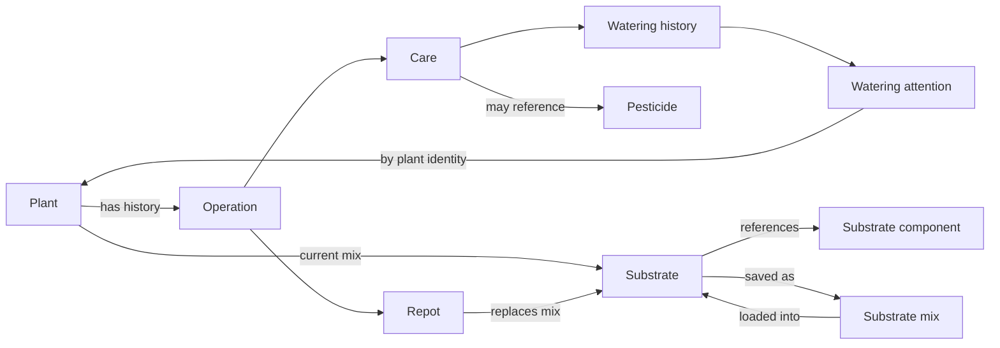
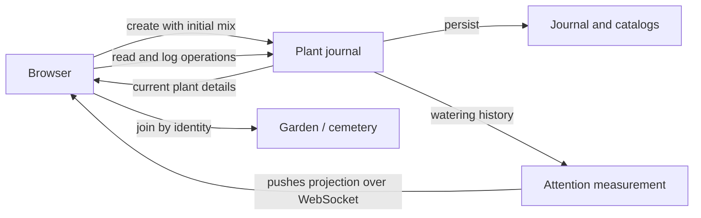

# plant-journal design

> Standard: Agentic Engineering Standards v1.2.0

## Overview

The journal owns plant identity and dated care history. Watering attention is a periodically refreshed projection, joined to current plant details only for presentation.

## Domain model

- Creation establishes the plant's initial mix independently of operation history; the latest repot by recorded date and identifier replaces it as the current mix, not the order of entry. Catalog identities remain stable across edits so historical references keep their meaning.
- A substrate mix is a named, independently-saved copy of a substrate, saved from or loaded into a plant's or repot operation's substrate; later edits or deletion of the mix never affect a substrate previously loaded from it, and it may be permanently deleted without a reference check.
- Archiving keeps plant history and its care-date range but prevents new operations; existing operation details may still be corrected without changing their date or kind.
- A logged operation may be permanently deleted from a plant's history, except a plant's current latest repot, which must remain so the plant's current substrate stays meaningful.

## Use cases and workflows

- Operation mutations are serialized. A latest-repot change that fails to update the plant compensates the operation write and preserves both failures if compensation also fails.
- The garden loads active plants and an archived count; the cemetery loads archived histories only when opened. After creation, the garden joins the new plant to the last complete attention projection and shows unavailable cadence until it has enough watering history. Unrelated attention identity mismatches fail the garden load; a recently archived plant may still appear in the last measurement.
- Garden plants without a measured cadence appear first in their existing order; the rest are ordered by time remaining until their next expected watering, most overdue first. A plant editor can close its nested substrate editor before closing itself, with each sheet sliding independently.
- Later refresh failures keep the last complete projection; insufficient watering history leaves cadence unavailable.
